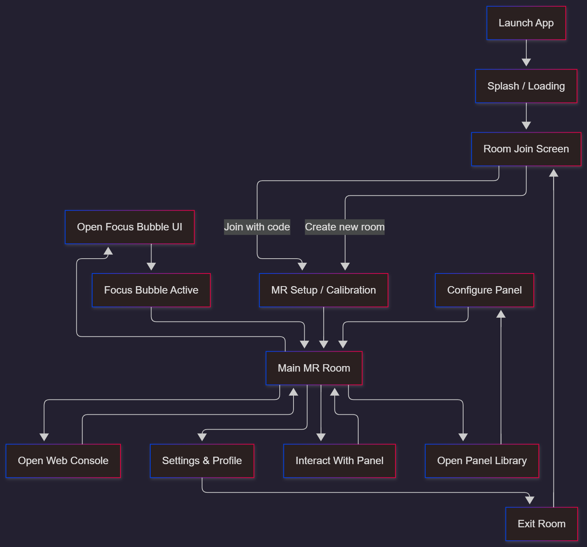
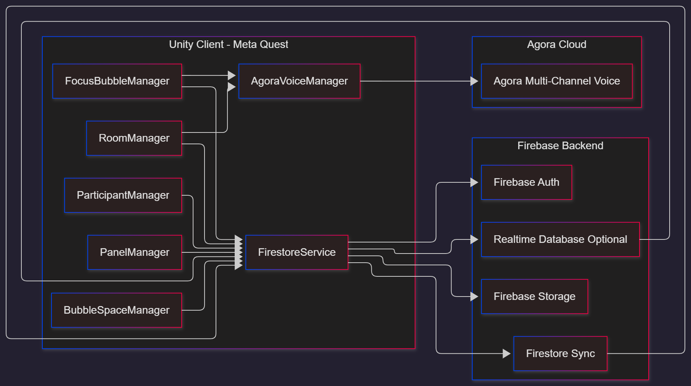
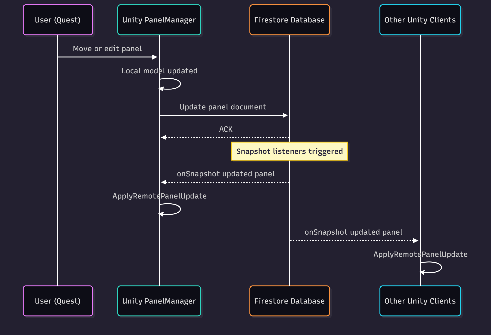
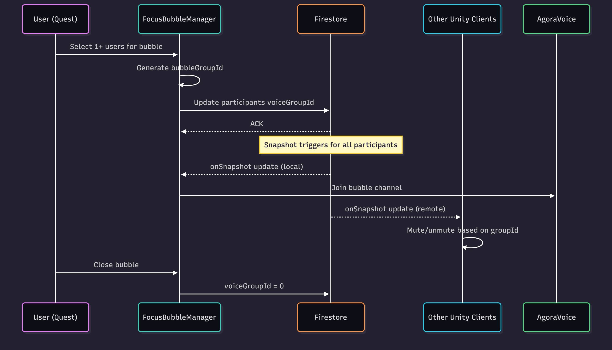
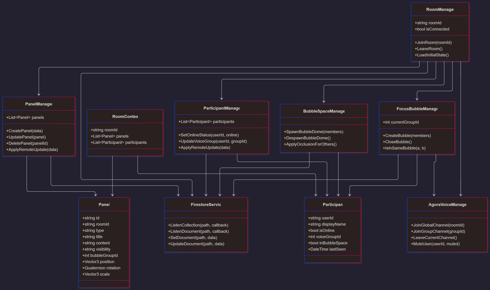

# 🧭 XR Cowork Hub

### **Mixed Reality Coworking Platform – Meta Quest / Unity / Firebase / Agora**

XR Cowork Hub is a **Mixed Reality coworking experience** for Meta Quest where multiple users can work together in the same real room using Passthrough, spatial XR panels, collaborative tools, instant private “Focus Bubbles”, and **fully isolated 3D Private Bubble Spaces**.

Designed for the **Meta Start Developer Competition**, the project focuses on:

* 🧠 Collaboration
* 🔊 Real-time voice groups
* 📄 Shared panels (Notes, PDFs, To-Dos, Sticky Notes…)
* 🫧 Private Bubbles (audio + visual isolation)
* 🏰 **Private 3D Bubble Spaces**
* ⚡ Smooth MR user experience
* 🏗 Zero-backend architecture (100% serverless)

---

# 🎨 UX Flow



---

# 📦 Features

### 🚀 Features list

- 🇺🇸 **English Version**  
  [Read the English feature list](features/feature-list.en.md)

- 🇵🇹 **Portuguese Version (Portugal)**  
  [Ler a lista de funcionalidades](features/feature-list.pt.md)

### 🧭 Passthrough MR Room

* See your real environment using Quest Passthrough.
* XR panels anchored in real space.
* Persistent workspace layout.

---

### 📂 XR Spatial Panels

* Kanban Board
* Sticky Notes Wall
* NotePad
* PDF Viewer
* Pomodoro Timer
* To-Do List
* Snapshots
* AI Summary Panel
* Image Viewer
* Whiteboard Blocks
* Shared Calendar
* Website Preview
* Bookmark List
* World Clock
* Mind Map
* Mini Chat

Panels are **movable / resizable / rotatable** in 3D space.

---

### 🧑‍🤝‍🧑 Multi-user Real-Time Collaboration

* Firestore sync for:

  * Panel data
  * Panel transforms
  * Edits
  * Participants
* Presence indicators (online, typing, bubble group)

---

### 🔇 Focus Bubbles

#### Basic Focus Bubbles
Private audio + visual isolation:

* Ghosting of other users (fade / desaturation)
* Only members of the bubble hear each other
* Ultra-simple implementation: `voiceGroupId`

### 🏰 **Private 3D Bubble Spaces (Premium Private Rooms)**

A **fully separate, immersive private 3D meeting room** that appears **only for the selected users**, combining:

* isolated voice communication
* a custom environment
* private spatial panels
* visual isolation from the main MR room
* dedicated Firestore state

This system extends the existing **Focus Bubble** logic by adding a **premium private environment**, making it feel like users are stepping into an actual **separate meeting room**, without ever leaving the XR coworking space.


### **What this achieves**

* true private meeting room
* premium “breakout room” feeling
* deeper collaboration zone
* real environment separation
* audio + visual + data isolation combined
* all while staying inside the same MR space

This transforms the Focus Bubble (audio-only) into a **fully immersive private collaboration module**, similar to stepping into a separate, high-end meeting room - but appearing instantly around the users.

---

# 🏗 Architecture Diagram



---

# 🗄️ Backend - Firestore Data Model

## participants

`rooms/{roomId}/participants/{userId}`

```jsonc
{
  "displayName": "Antonin",
  "voiceGroupId": 0,
  "isOnline": true,
  "inBubbleSpace": false,
  "lastSeen": "timestamp"
}
```

---

## panels

`rooms/{roomId}/panels/{panelId}`

```jsonc
{
  "type": "note",
  "title": "Pitch Notes",
  "content": "text...",
  "visibility": "room",     // room | owner | bubble
  "bubbleGroupId": 0
}
```

---

# 🔄 Panel Sync Sequence Diagram



---

# 🫧 Focus Bubbles Sequence Diagram



---

# 🎤 Focus Bubbles – Technical Design

### ✔ Only one field: `voiceGroupId`

No separate “bubbles” collection needed.

### Create a bubble

```csharp
long newGroupId = DateTimeOffset.UtcNow.ToUnixTimeMilliseconds();
await participantRef.UpdateAsync("voiceGroupId", newGroupId);
```

### Leave bubble

```csharp
await participantRef.UpdateAsync("voiceGroupId", 0);
```

### Unity logic

```csharp
bool SameGroup(Participant a, Participant b)
    => a.voiceGroupId == b.voiceGroupId;

avatar.SetGhost(!SameGroup(other, me));
audio.Mute(other) if (!SameGroup(other, me));
audio.Unmute(other) if ( SameGroup(other, me));
```

---

# 🏰 Private Bubble Spaces - Technical Details

### Spawn bubble

```csharp
BubbleSpaceManager.SpawnBubbleDome(groupMembers);
```

### Mark participants inside

```csharp
Firestore.Update("inBubbleSpace", true);
```

### Bubble-only panels

```csharp
visibility = "bubble";
bubbleGroupId = currentGroupId;
```

### Leave bubble

```csharp
BubbleSpaceManager.DespawnCurrentBubble();
```

---

# 🧩 Unity Architecture

```
/Assets
  /Scripts
    /Managers
      RoomManager.cs
      PanelManager.cs
      ParticipantManager.cs
      FocusBubbleManager.cs
      BubbleSpaceManager.cs
      FirestoreService.cs
      AgoraVoiceManager.cs
  /Prefabs
    /Panels
    /Avatars
    /BubbleDome
  /Scenes
    MainScene.unity
```

---

# 🧱 Unity Class Diagram



---

# 🧱 Tech Stack

### 🎮 Unity Client

* Unity 6000 / 2023 LTS
* URP
* OpenXR + Meta XR
* XR Interaction Toolkit
* Modular C#
* TextMeshPro

### 🔥 Firebase Backend (Serverless)

* Firestore
* Storage
* Realtime DB (optional)
* Auth (Anon)

### 🎤 Voice

* Agora Multichannel Voice

### 🌐 Web Console

* React / Next.js
* Upload PDFs / Images
* Firebase Web SDK

---

# 🚀 Getting Started (Developers)

### 1. Clone project

```bash
git clone https://github.com/P-and-A-Dev/xr-cowork-hub.git
```

### 2. Open Unity

Open `unity-client/` in Unity Hub.

### 3. Install packages

* XR Interaction Toolkit
* Firebase Unity SDK
* Agora SDK

### 4. Configure Firebase

Add `google-services.json`

### 5. Configure Agora

Add your APP ID.

### 6. Run

Open MainScene → Play.

---

# 🔮 Roadmap

### 📋 Tasklist

- 🇺🇸 **English Version**  
  [Read the English tasklist](tasks/tasks.en.md)

- 🇵🇹 **Portuguese Version (Portugal)**  
  [Ler a lista de tarefas](tasks/tasks.pt.md)

### MVP

* Notes / To-Do / PDF panels
* Focus bubbles
* **Private 3D Bubble Spaces**
* Multi-user sync
* Web console uploads

### Future

* Multi-room
* AI assistants
* Persistent anchors
* Live screen sharing
* Gesture interactions
* Custom bubble themes

---

# 📄 License

Apache 2.0

---

# 👥 Authors

- **Pietro Giacomelli**
- **Antonin Do Souto**